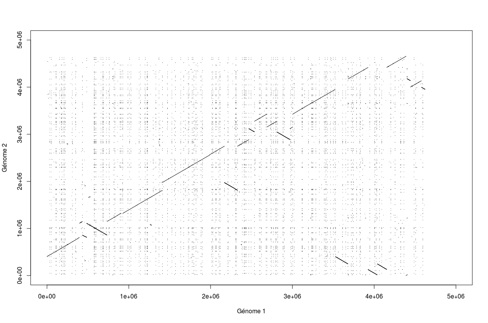
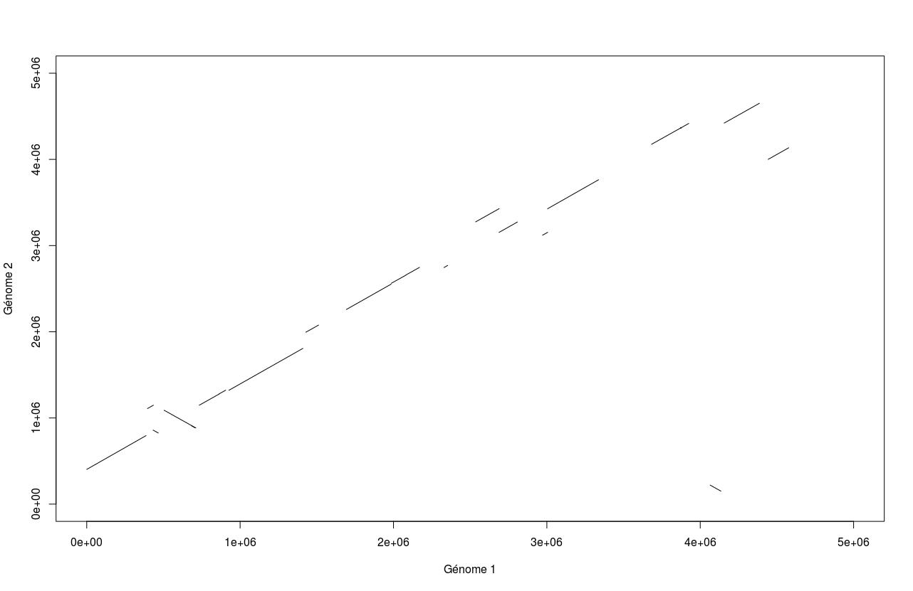

# Introduction 

Ce programme a été écrit sous R dans le fichier `dot_matrix_vf.R` , il permet de construire la matrice des positions des gènes orthologues, entre la souche médiévale de la peste noire et la souche actulle de  Yernisia pestis CO92. 

# Dot matrix initiale

Le génome actuel possède 3551058 bases et elles sont toutes définies alors que le génome médiéval possède 3533579 bases dont 25769 ne sont pas définies. Le génome actuel est donc plus grand que le génome médiéval.
Nous avons aligné les deux séquences sur BLAST et nous avons ainsi pu reproduire sur R la dot matrix correspondante :

# Dot matrix finale

Après plusieurs étapes de filtrage et de fusion des segments orthologues, nous conservons 21 fragments et nous avons ainsi obtenu la dot matrix suivante :

# Caractérisation du génome de Yernisia pestis CO92 et de la souche médiévale

Une caractérisation des génomes étudiés a été réalisée grâce au programme `comptage.py`, à partir des données génomiques `1348_chromosome.txt` et `Yernisia_pestis.txt`.