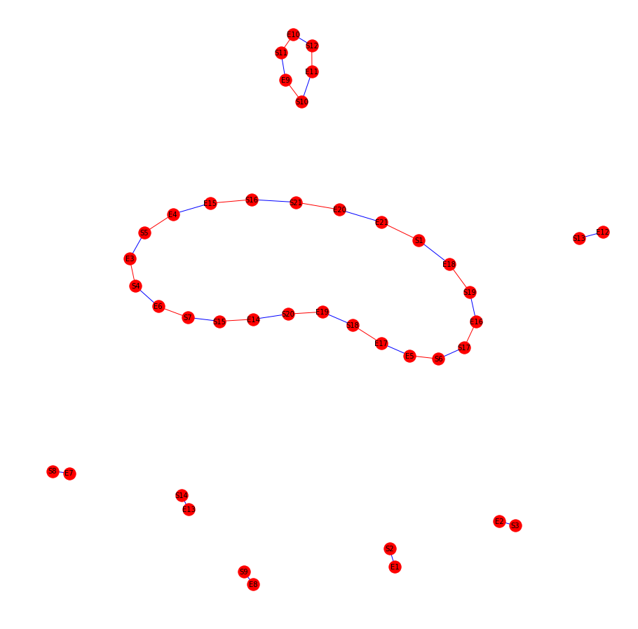

# Introduction 

Ce programme a été écrit sur jupyter, il permet de construire le graph associé à la dot matrix résultante du programme `dot_matrix_vf.R`. Le nombre de cycles observé permet d'inférer le nombre d'inversions séparant le génome de la souche médiévale de la peste noire et le génome de la souche actuelle. Ce programme permet également de générer un indice statistique pour estimer si un tel nombre d'inversions pourrait résulter d'un processus aléatoire.

# Résultats

Pour plus de lisibilité, le jupyter notebook a été exporté au format html.
Le graph résultant du traitement de la dot-matrix est le suivant :

