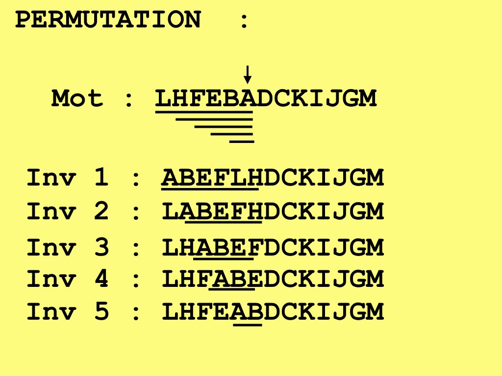
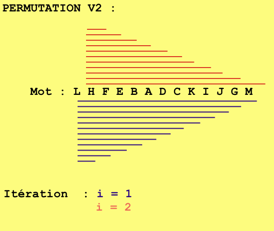
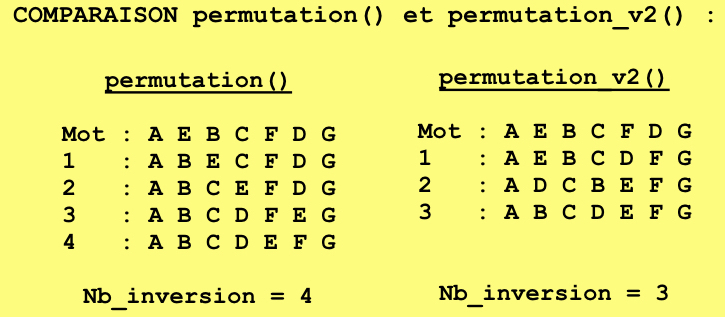
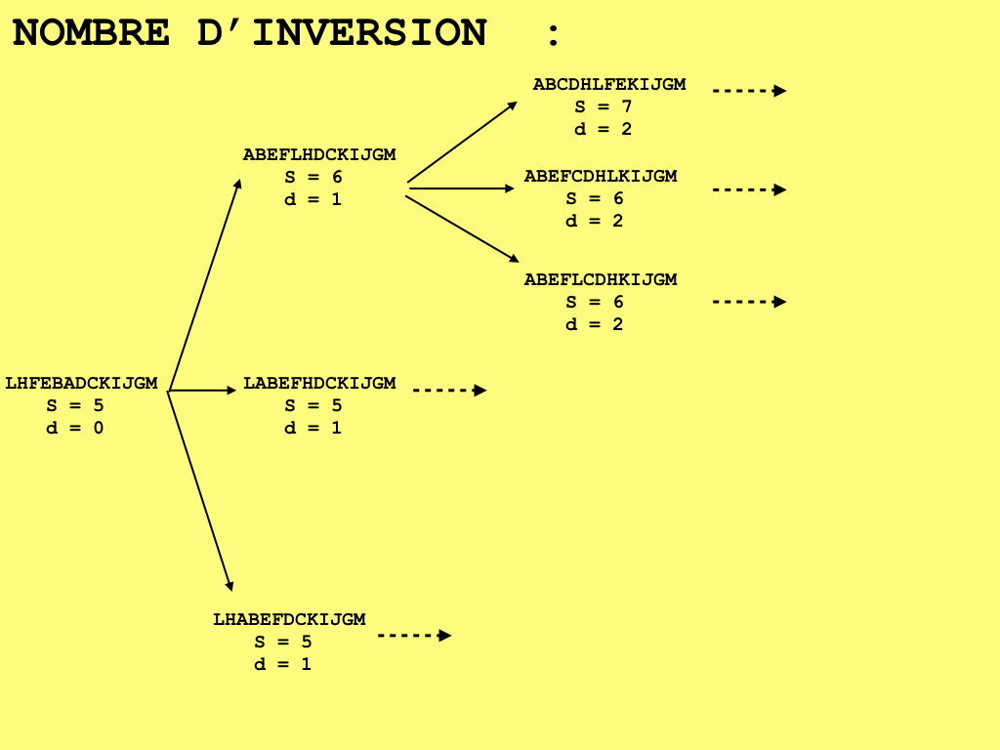

Implémentation d'une heuristique optimisant le nombre d'inversion :
===================================================================

Calcul d'un score d'organisation :
----------------------------------

Afin de connaître à tout moment l'état d'organisation de la séquence en cours d'analyse, nous avons mis en place un score. Ce score traduit  le nombre de lettre bien placées. Pour être  calculer nous avons dénombrer le nombre d'éléments adjacents, soit le nombre de lettres consécutives dans l'ordre alphabétique, ceci est réalisé grâce à la fonction *adjacent*. Le score d'une séquence est donc égal à la longueur de la liste retournée par *adjacent* plus un si la première lettre est bien placée et plus un si la dernière lettre est bien placée. Ce score est calculé par la fonction *Score*. Pour simplifier notre exposé nous parlerons de séquences lettres, bien que pour faciliter l'implémentation de la méthode les séquences de lettres sont généralement converties en liste d'entiers correspondant  aux valeurs ascii des caractères, via la fonction *ConvertAsci*.

.. image:: _static/SCORE.jpeg

Énumération des permutations :
------------------------------

Pour résoudre le problème de Sturtevant, chaque inversion doit permettre d'augmenter la taille de la séquence triée, soit le score. Ainsi d'après l'exemple mentionné ci-dessus nous pourrions inverser la séquence afin de placer le "A" en première position, le "B" serait alors bien placé. Puis réaliser une nouvelle inversion pour placer le "C" à la suite du "B, ce qui permettrait de bien positionner la lettre "D" etc. Cette logique permettrait d'obtenir la solution mais le nombre d'inversion nécessaire n'est pas optimal. En effet en réalisant un tel processus, 8 inversions sont nécessaires.
Pour améliorer ce résultat il faudra retenir toutes les inversions  permettant d'augmenter le score, et pas nécessairement celles permettant de trier le début de la séquence. Nous raisonnerons en terme d'arbre, en mémorisant tous les chemins menant à la solution nous pourront retrouver la solution optimale.
Nous avons ainsi implémenté la fonction *permutation* qui énumère  les inversions possibles.  Toutes les inversions permettant de conserver ou d'augmenter le score seront conservées. Reprenons l'exemple :

La fonction *permutation* prend en argument le score courant de la séquence et fait appel à la fonction *end_ord* qui retourne l'indice de la dernière lettre bien placée. Puis elle appelle la fonction *inversion* qui permet de permuter l'ordre de la séquence. Cette fonction est appelée itérativement pour  i  allant de 2 à la taille de la séquence à inverser. La fonction *permutation* retourne  une liste des inversions ayant permis d'augmenter ou de conserver le score, à chaque élément de la liste contient donc la séquence inversée, son score, et sa distance à l'origine (soit le nombre d'inevrsions nécessaire qui ont permis d'obtenir cet état d'ordonnancement).

Une seconde version de permutation, nommée *permutation_v2* a été écrite pour prendre en compte toutes les inversions  y compris celles en dehors des éléments situés entre la fin de la séquence triée et la première lettre minimale. Elle permet ainsi de tester d'avantage de combinaisons, toutefois le temps de calcul est fortement augmenté. Seules les inversions permettant d'augmenter ou de maintenir le score seront conservées, de plus si la distance à l'origine d'une possibilité est supérieure à *taille de seq + 1*, cette possibilité est rejeté, car alors quelque soit le scénario il sera sous optimal.   Reprenons  l'exemple :

Les avantages de la fonction *permutation_v2* peuvent être explicitement montrés dans l'exemple suivant : 

Remarque : *permutation* prend un troisième argument qui est la distance à l'origine que nous introduirons dans le paragraphe suivant.

Construction de l'arbre :
-------------------------

Afin de trier la séquence nous allons générer des séries d'inversions, pour cela nous créons une fonction *nb_inversion*, qui fait appel à *permutation* ou à *permutation_v2* selon l'option choisie par l'utilisateur. La fonction *nb_inversion* prend en argument la liste à trier. Elle calcule son score initial et appelle une première fois  *permutation_v2*, les résultats retournés sont mémorisés dans une pile. Tant que cette pile n'est pas vide*nb_inversion* appelle  *permutation_v2* en prenant le premier élément de la pile, soit une des liste à  retenue par *permutation* au tour précédent. Cet liste est associée à son score courant et à sa distance à l'origine, qui a été incrémentée d'une unité. L'élément de la pile qui vient d'être traité est supprimé et les résultats retournés par ce nouvel appel  sont placés en tête. Ceci permet de continuer le trie de la séquence à partir d'une des proposition retenue au tour précédent.  Le parcours d'une branche est terminé lorsque le score est équivalent à celui de la séquence triée. La distance à l'origine qui correspond au nombre d'inversions nécessaires pour trier une branche est retenue. À la fin du parcours de l'arbre on obtient une liste des distances. La fonction *nb_inversion* retourne finalement la distance minimale.

Génération d'échantillons  aléatoires :
---------------------------------------

Afin d'évaluer si les nombres minimaux d'inversions observés, pour les gènes 6, 7 et 13, pourraient être dus au hasard, nous avons répété le processus sur des séquences aléatoires. Pour ce faire nous avons créer une fonction nommée  *scenario_aleatoire*. Elle prend en entrée une liste, et un nombre d'itérations. Pour chaque itération elle génère une version aléatoire de la liste donnée en entrée (cf :*seq_aleatoire*). Puis elle fait appel à la fonction *nb_inversion*, pour déterminer le nombre minimal d'inversions nécessaire pour trier cette séquence aléatoire. Les résultats de chaque itération sont conservés dans une liste. Cette liste peut être donnée en argument à la fonction *stat_parente*, qui étant donné  le nombre minimal d'inversions observé pour la séquence d'intérêt, retourne la probabilité d'observer un tel résultat sous l'hypothèse du hasard. La statistique générée correspond à la proportion de résultats aléatoires qui sont inférieurs au résultat d'intérêt. *Remarque : * La fonction *scenario_aleatoire* peut écrire les résultats dans un fichier texte, si l'option est activée. Ceci a été implémenté en raison du temps de calcul nécessaire pour les séquences de grandes tailles (>13). 

Résultats :
-----------

Nous obtenons les résultats suivants: 

* Pour le chromosome III_R de taille 7, l'ordre des gènes de *Melanosgater* est *A E B C F D G*. Le nombre d'inversion minimal est de 3. La proportion de séquences aléatoires de longueur 7 obtenant un score inférieur est de 0.316, pour 500 tirages.
* Pour le chromosome III_L  dont l'ordre des gènes est *C F E B A D*, le nombre minimal d'inversion obtenu est de 3. La proportion de séquences aléatoires de taille 6 ayant un score inférieur est de $0.17$ (pour 500 tirages).
* Pour le chromosome II_R dont l'ordre des gènes est *A C E B F D*, le nombre minimal d'inversion obtenu est de 4. La proportion de séquences aléatoires de taille 6 ayant un score inférieur est de 0.602 (pour 500 tirages).
* Pour le chromosome II_L dont l'ordre des gènes est *D E F A C B*, le nombre minimal d'inversion obtenu est de 2. La proportion de séquences aléatoires de taille 6 ayant un score inférieur est de 0.048 (pour 500 tirages).
* Pour le chromosome X dont l'ordre des gènes est *L H F E B A D C K I J G M*, le nombre minimal d'inversion obtenu est de 6. La proportion de séquences aléatoire de taille 6 ayant un score inférieur est de 0.015 (pour 66 tirages). Ce résultats permet de corriger les affirmations de Sturtevant, qui calculait pour ce chromosome un nombre d'inversion minimal de 7.

Les nombres d'inversions minimaux ont été calculés grâce à l'utilisation de *permutation_v2*, pour les séquences biologiques. Cependant en raison des temps de calcul, la fonction *permutation* a été utilisée pour les séquences aléatoires. Il est ainsi probable que les proportions calculées soient quelque peu biaisées.
D'après ces résultats pour les chromosomes X et II_L la probabilité d'obtenir par hasard les nombres minimaux d'inversions observés, de respectivement 6 et 2, est faible <0.05. Ainsi on peut affirmer qu'il existe un lien de parenté entre les deux espèces de drosophile *Pseudoobscura* et *D. Melanogaster*. Pour les chromosomes II_R, III_L et III_R, les nombres nombres minimaux d'inversions obtenus pourraient être dûs au hasard, la structure de ces chromosomes est donc moins conservés. 

